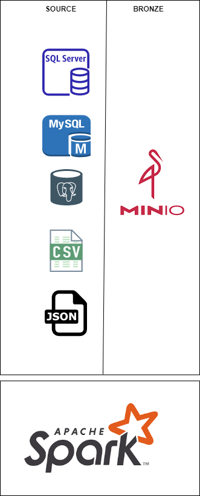
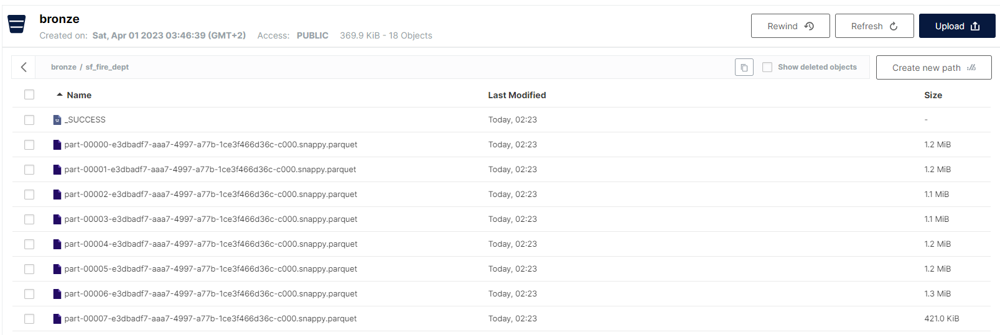

# spark + minIo

## reading a csv and saving as parquet on bronze as a test scenario.

MinIO offers high-performance, S3 compatible object storage. Native to
Kubernetes, MinIO is the only object storage suite available on every public
cloud, every Kubernetes distribution, the private cloud and the edge. MinIO
is software-defined and is 100% open source under GNU AGPL v3.

https://min.io/

### This is the high level architecture

### This is the output on bronze for tests

